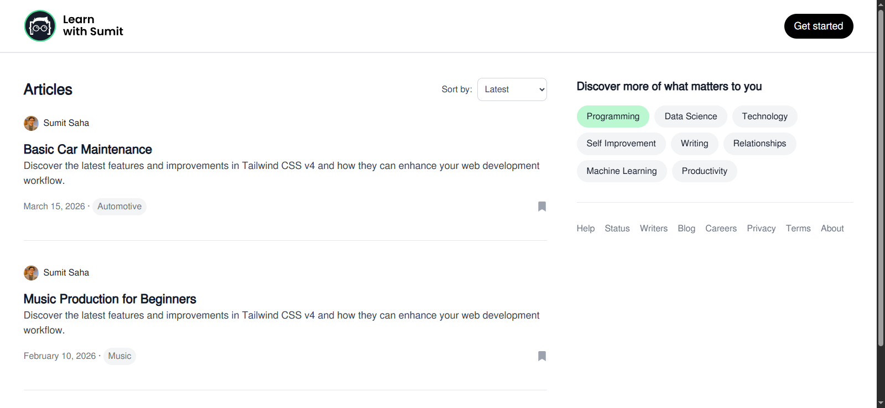
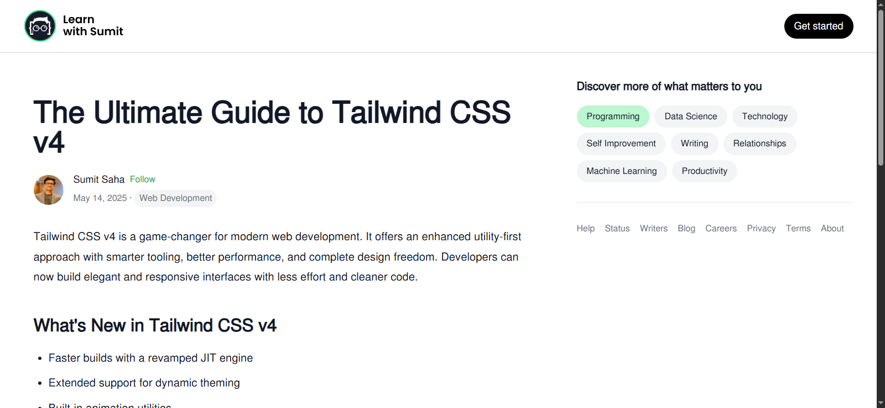

# 📝 Blogify – Server-Side Rendered Blog Platform

Blogify is a **practice project** built using **Next.js 14 (App Router)** and **Tailwind CSS**, designed to explore core concepts like server-side rendering, dynamic routing, local data loading, filtering, and sorting — all without any backend or API.

## 📸 Screenshot

---

## 🚀 Features

- ✅ Blog listing from local `data.json` (no API calls)
- ✅ Server-side rendering using App Router
- ✅ Dynamic blog detail pages using blog title as slug
- ✅ HTML rendering using `dangerouslySetInnerHTML`
- ✅ Category filter with multi-select toggle
- ✅ Sort by latest or oldest date
- ✅ Handles not found pages gracefully
- ✅ Clean and responsive UI using Tailwind CSS

---

## 📂 Pages

### 🏠 Home Page

- Lists all blogs from `data.json`
- Filters blogs by selected categories
- Sorts blogs by publish date (latest/oldest)
- Server-side filtered and sorted content based on query parameters

### 📄 Blog Details Page

- Dynamic route: `/blog/{slug}`
- Parses blog data based on title-to-slug conversion
- Renders blog content using `dangerouslySetInnerHTML`
- Shows a "Not Found" message if the blog doesn't exist

---

## 📚 What I Learned

- Using **Next.js 14 App Router** effectively
- Implementing **server-side rendering** (SSR) with `searchParams`
- Working with **static local data** (no API usage)
- Creating **dynamic routes** based on title slugs
- Using **`dangerouslySetInnerHTML`** to render raw HTML safely
- Building UI with **Tailwind CSS**
- Managing **multi-select category filtering** and server-based sorting

---

## 👨‍💻 Developer

Developed by **[Taib Islam Dipu](https://github.com/taibislamdipu)**  
GitHub: [github.com/taibislamdipu](https://github.com/taibislamdipu)

---

## 🛠️ Tech Stack

- **Next.js 14** (App Router)
- **Tailwind CSS**
- **JavaScript (No TypeScript)**
- **Local JSON Data Source**
